# OpenJS Foundation Artwork and Logos

_Note: GitHub Flavored Markdown used in the Readme doesn't support background colors. The white logos below are displayed on the light grey of tables._

## About this artwork

This repo hosts artwork for the [OpenJS Foundation](https://openjsf.org) and its [hosted projects](https://openjsf.org/projects). Before you use this artwork, please be aware that it is subject to the [Trademark Policy](https://trademark-policy.openjsf.org) of the OpenJS Foundation.

You should take the time to read and understand the [Trademark Policy](https://trademark-policy.openjsf.org), as it will help you to understand the situations in which you can use the marks without asking, and when you need to ask for permission.

At a high level, these marks have been created to refer to open source projects and organizations. The [Trademark Policy](https://trademark-policy.openjsf.org) (as adopted by the [OpenJS Foundation Board of Directors](https://openjsf.org/about/governance)) is designed to strike a balance between enabling project communities to use them and protecting their value. For a list of marks covered by the [Trademark Policy](https://trademark-policy.openjsf.org), please see the [Trademark List](https://trademark-list.openjsf.org). If you have questions, please reach out to [trademark@openjsf.org](mailto:trademark@openjsf.org).

Finally, we recognize that project artwork may change over time, and many projects maintain their artwork in their source repos. The goal of this repo is to mirror those assets in a single place. If you have a vector version of your project's artwork (.svg, .eps, .ai), please submit a PR to add it to the gallery.

We can also help you make minor changes (for example, creating a stacked variant of your logo, converting to monochrome, or extracting an icon). For help with this, please reach out to [operations@openjsf.org](mailto:operations@openjsf.org).

If you're building or managing a website for an OpenJS Foundation-hosted project, please see our guidance on the [proper text to use in website footers](#copyright-notices-for-project-website-footers).

## Getting help

If you have a question about this policy or how to implement it, please reach out to [legal-questions@lists.openjsf.org](mailto:legal-questions@lists.openjsf.org).

## OpenJS Foundation Logos

- [OpenJS Foundation style guide](./openjs_foundation/openjs_foundation-brand_guide.png)

<table>
    <tr>
    	<th colspan="7"></th>
    </tr>
    <tr>
        <th width="120"></th>
        <th colspan="3">PNG</th>
        <th colspan="3">SVG</th>
    </tr>
    <tr>
        <th width="120"></th>
        <th>horizontal</th>
        <th>stacked</th>
        <th>icon</th>
        <th>horizontal</th>
        <th>stacked</th>
        <th>icon</th>
    </tr>
    <tr>
        <th>color, dark background</th>
        <td></td>
        <td></td>
        <td>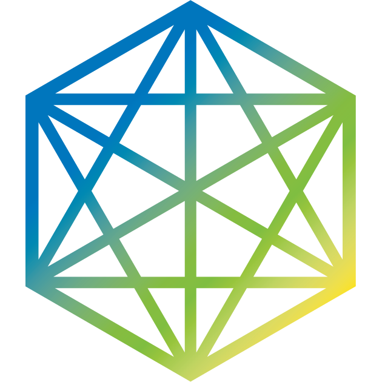</td>
        <td></td>
        <td></td>
        <td></td>
    </tr>
    <tr>
        <th>color</th>
        <td></td>
        <td></td>
        <td></td>
        <td></td>
        <td></td>
        <td></td>
    </tr>
    <tr>
        <th>white</th>
        <td></td>
        <td></td>
        <td>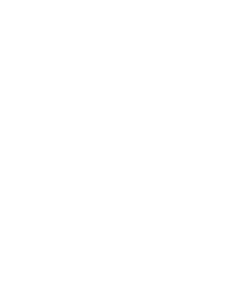</td>
        <td></td>
        <td></td>
        <td>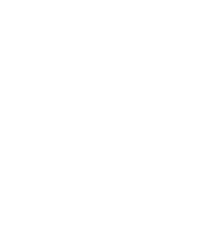</td>
    </tr>
    <tr>
        <th>black</th>
        <td></td>
        <td></td>
        <td></td>
        <td></td>
        <td></td>
        <td></td>
    </tr>
</table>

## Impact projects

Impact projects have reached their growth goals and are now on a sustaining cycle of development, maintenance, and long-term support. These projects are used commonly in enterprise production environments and have large, well-established project communities.

Impact projects are expected to participate actively in Cross Project Council proceedings, and as such have a binding vote on CPC matters requiring a formal vote, such as the election of a CPC Director. They receive ongoing financial and marketing support from the Foundation, and are expected to cross-promote the foundation along with their activities.

### Appium

- [Appium Style Guide](./projects/appium/appium_graphic_standards-v8.pdf)

<table>
    <tr>
    	<th colspan="7"></th>
    </tr>
    <tr>
        <th width="120"></th>
        <th colspan="3">PNG</th>
        <th colspan="3">SVG</th>
    </tr>
    <tr>
        <th width="120"></th>
        <th>horizontal</th>
        <th>stacked</th>
        <th>icon</th>
        <th>horizontal</th>
        <th>stacked</th>
        <th>icon</th>
    </tr>
    <tr>
        <th>color, flat</th>
        <td></td>
        <td>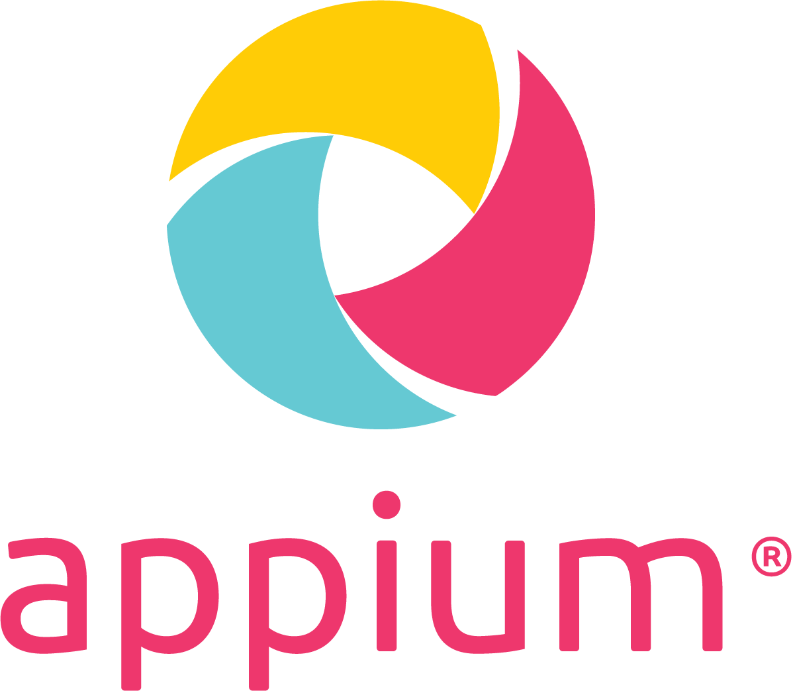</td>
        <td></td>
        <td></td>
        <td></td>
        <td></td>    </tr>
    </tr>
    <tr>
        <th>color</th>
        <td></td>
        <td>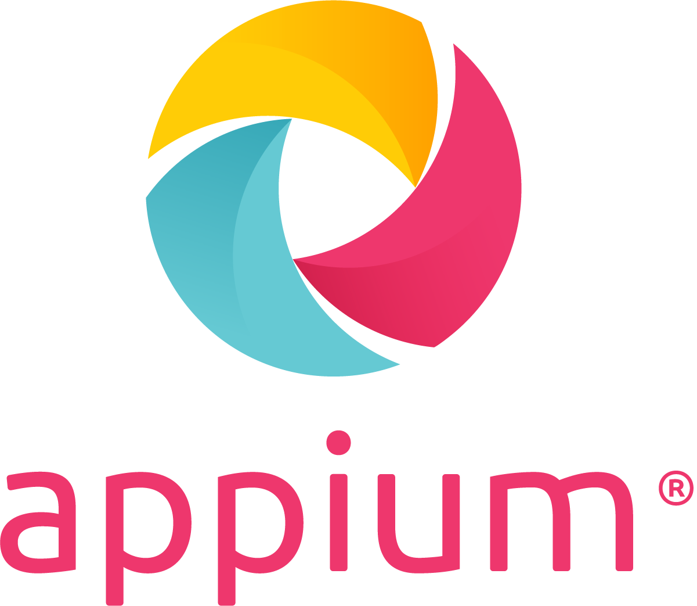</td>
        <td></td>
        <td></td>
        <td>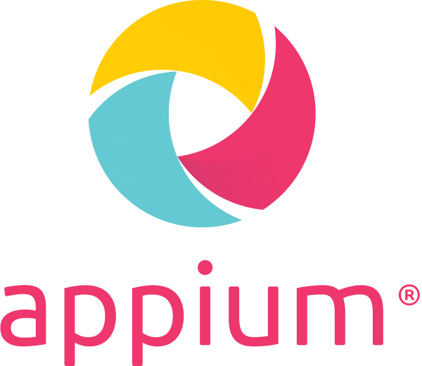</td>
        <td>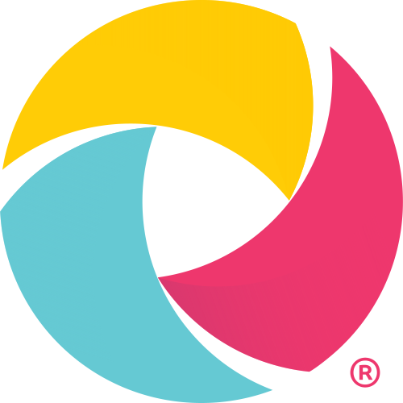</td>    </tr>
    </tr>
    <tr>
        <th>color, dark background</th>
        <td></td>
        <td>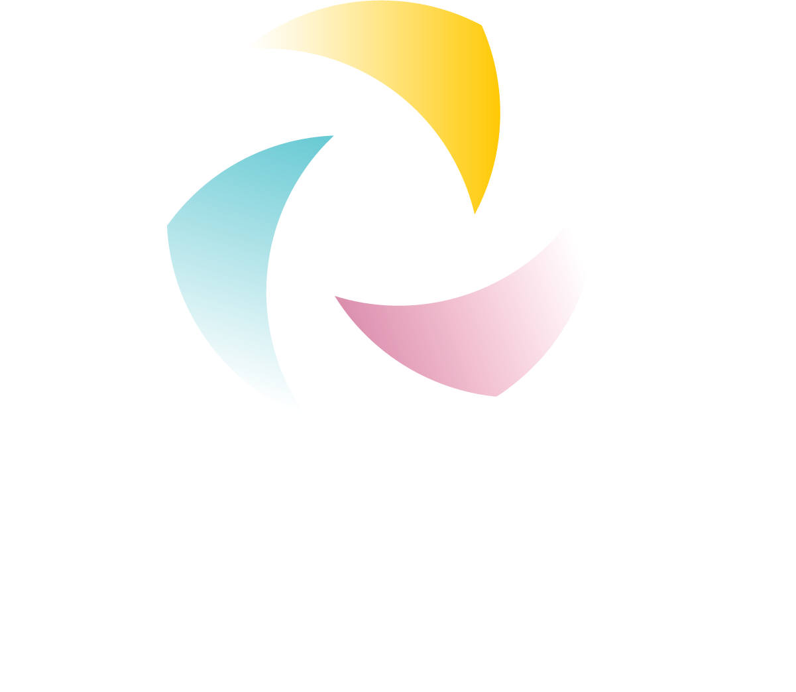</td>
        <td></td>
        <td></td>
        <td>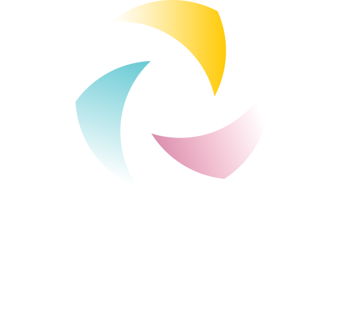</td>
        <td></td>
    </tr>
    <tr>
        <th>grayscale</th>
        <td></td>
        <td></td>
        <td></td>
        <td></td>
        <td></td>
        <td></td>
    </tr>
    <tr>
        <th>grayscale, dark background</th>
        <td></td>
        <td>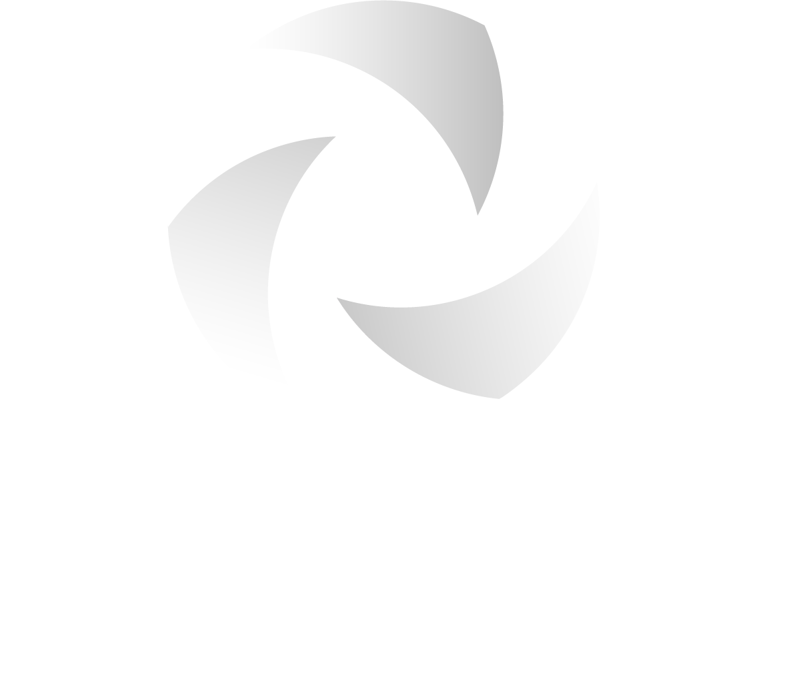</td>
        <td></td>
        <td></td>
        <td></td>
        <td></td>
    </tr>
</table>

### Dojo

- [Dojo color study](./projects/dojo/other/dojo-logo.ai)

<table>
    <tr>
    	<th colspan="7"></th>
    </tr>
    <tr>
        <th width="120"></th>
        <th colspan="3">PNG</th>
        <th colspan="3">SVG</th>
    </tr>
    <tr>
        <th width="120"></th>
        <th>horizontal</th>
        <th>stacked</th>
        <th>icon</th>
        <th>horizontal</th>
        <th>stacked</th>
        <th>icon</th>
    </tr>
    <tr>
        <th>color, dark background</th>
        <td></td>
        <td></td>
        <td></td>
        <td></td>
        <td></td>
        <td></td>
    </tr>
    <tr>
        <th>color</th>
        <td></td>
        <td></td>
        <td></td>
        <td></td>
        <td></td>
        <td></td>
    </tr>
    <tr>
        <th>white</th>
        <td></td>
        <td></td>
        <td></td>
        <td></td>
        <td></td>
        <td></td>
    </tr>
    <tr>
        <th>black</th>
        <td></td>
        <td></td>
        <td></td>
        <td></td>
        <td></td>
        <td></td>
    </tr>
</table>

### Electron

<table>
    <tr>
    	<th colspan="7"></th>
    </tr>
    <tr>
        <th width="120"></th>
        <th colspan="3">PNG</th>
        <th colspan="3">SVG</th>
    </tr>
    <tr>
        <th width="120"></th>
        <th>horizontal</th>
        <th>stacked</th>
        <th>icon</th>
        <th>horizontal</th>
        <th>stacked</th>
        <th>icon</th>
    </tr>
    <tr>
        <th>color, dark background</th>
        <td></td>
        <td></td>
        <td></td>
        <td></td>
        <td></td>
        <td></td>
    </tr>
    <tr>
        <th>color</th>
        <td></td>
        <td>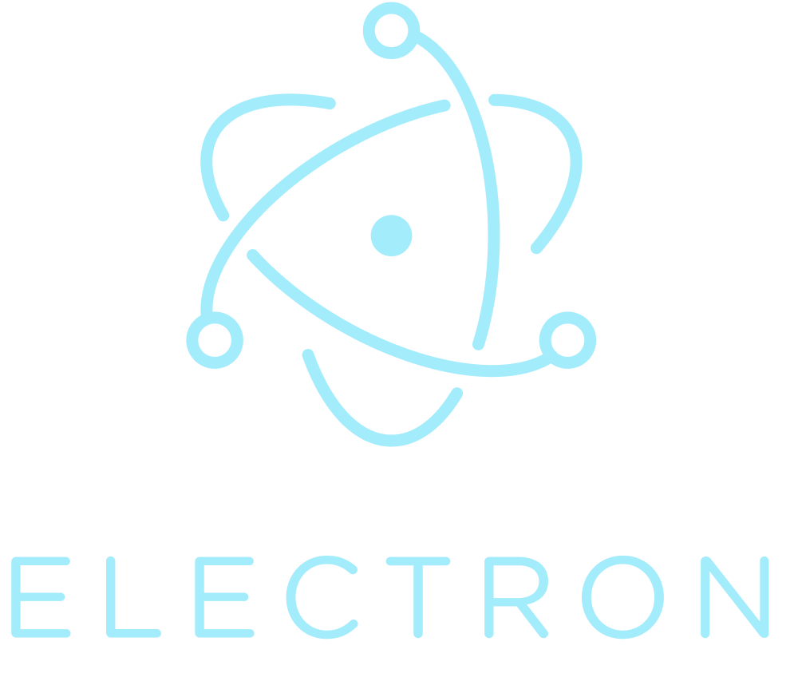</td>
        <td></td>
        <td></td>
        <td></td>
        <td></td>
    </tr>  
    <tr>
        <th>grayscale, dark background</th>
        <td></td>
        <td></td>
        <td></td>
        <td></td>
        <td></td>
        <td></td>
    </tr>
    <tr>
        <th>grayscale, light background</th>
        <td></td>
        <td></td>
        <td></td>
        <td></td>
        <td>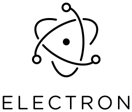</td>
        <td></td>
    </tr>
</table>


### jQuery

- [jQuery color study](./projects/jquery/other/jQuery-Color_Study.ai)

<table>
    <tr>
    	<th colspan="7"></th>
    </tr>
    <tr>
        <th width="120"></th>
        <th colspan="3">PNG</th>
        <th colspan="3">SVG</th>
    </tr>
    <tr>
        <th width="120"></th>
        <th>horizontal</th>
        <th>stacked</th>
        <th>icon</th>
        <th>horizontal</th>
        <th>stacked</th>
        <th>icon</th>
    </tr>
    <tr>
        <th>color, dark background</th>
        <td></td>
        <td></td>
        <td></td>
        <td></td>
        <td></td>
        <td></td>
    </tr>
    <tr>
        <th>color</th>
        <td></td>
        <td></td>
        <td></td>
        <td></td>
        <td></td>
        <td></td>    </tr>
    </tr>
</table>

### Node.js

- [Pantone color versions](./projects/nodejs/other/nodejs-pantone.zip)

<table>
    <tr>
    	<th colspan="7"></th>
    </tr>
    <tr>
        <th width="120"></th>
        <th colspan="3">PNG</th>
        <th colspan="3">SVG</th>
    </tr>
    <tr>
        <th width="120"></th>
        <th>horizontal</th>
        <th>stacked</th>
        <th>icon</th>
        <th>horizontal</th>
        <th>stacked</th>
        <th>icon</th>
    </tr>
    <tr>
        <th>color, dark background</th>
        <td></td>
        <td></td>
        <td>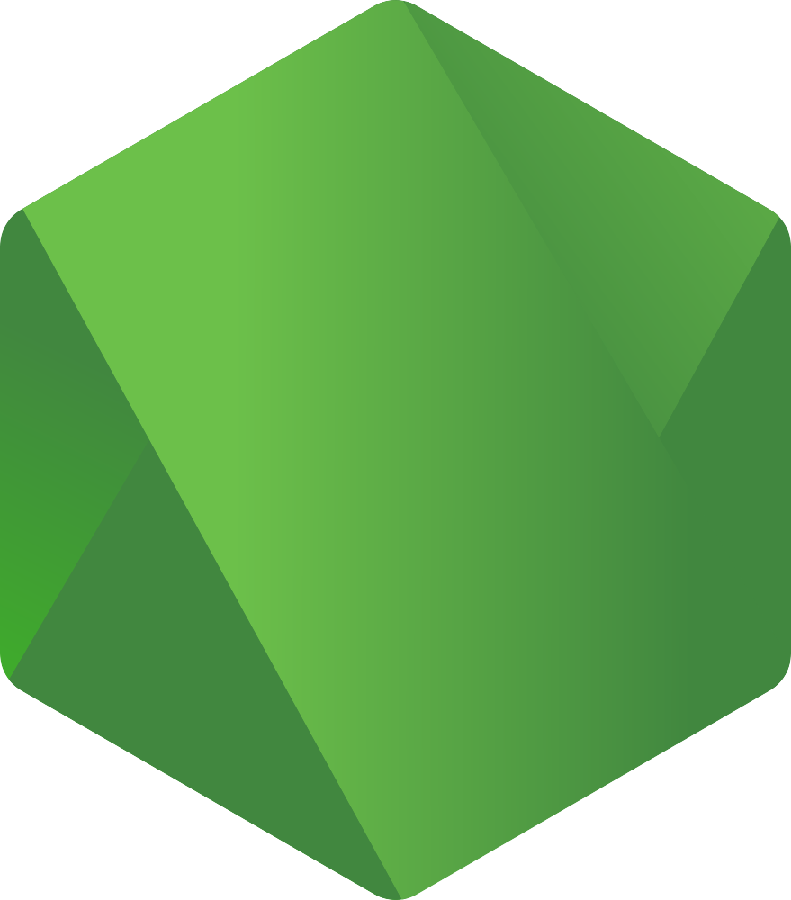</td>
        <td></td>
        <td></td>
        <td></td>
    </tr>
    <tr>
        <th>color</th>
        <td></td>
        <td></td>
        <td></td>
        <td></td>
        <td></td>
        <td></td>
    </tr>  
    <tr>
        <th>grayscale, dark background</th>
        <td>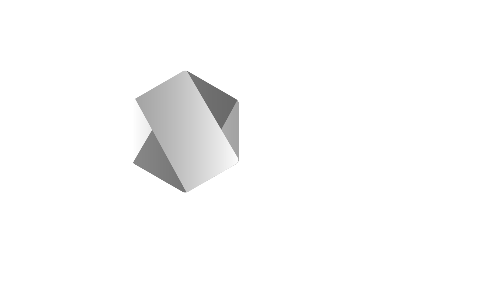</td>
         <td></td>
        <td></td>
        <td></td>
           <td></td>
        <td></td>
    </tr>
</table>

### webpack

<table>
    <tr>
    	<th colspan="7"></th>
    </tr>
    <tr>
        <th width="120"></th>
        <th colspan="3">PNG</th>
        <th colspan="3">SVG</th>
    </tr>
    <tr>
        <th width="120"></th>
        <th>horizontal</th>
        <th>stacked</th>
        <th>icon</th>
        <th>horizontal</th>
        <th>stacked</th>
        <th>icon</th>
    </tr>
    <tr>
        <th>color, dark background</th>
        <td></td>
        <td>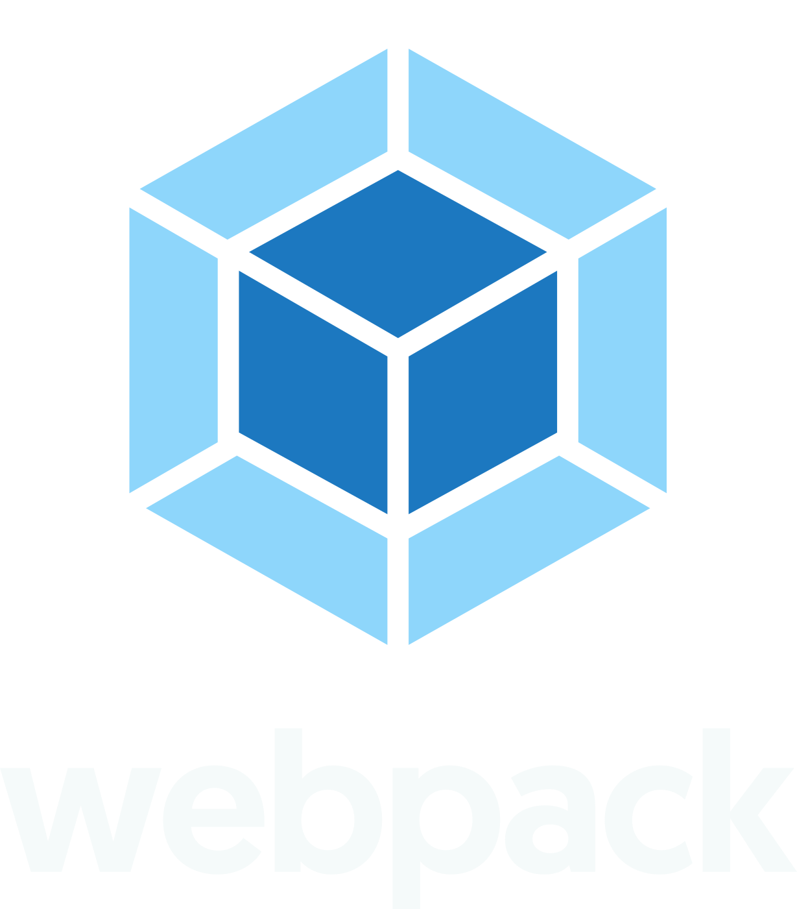</td>
        <td>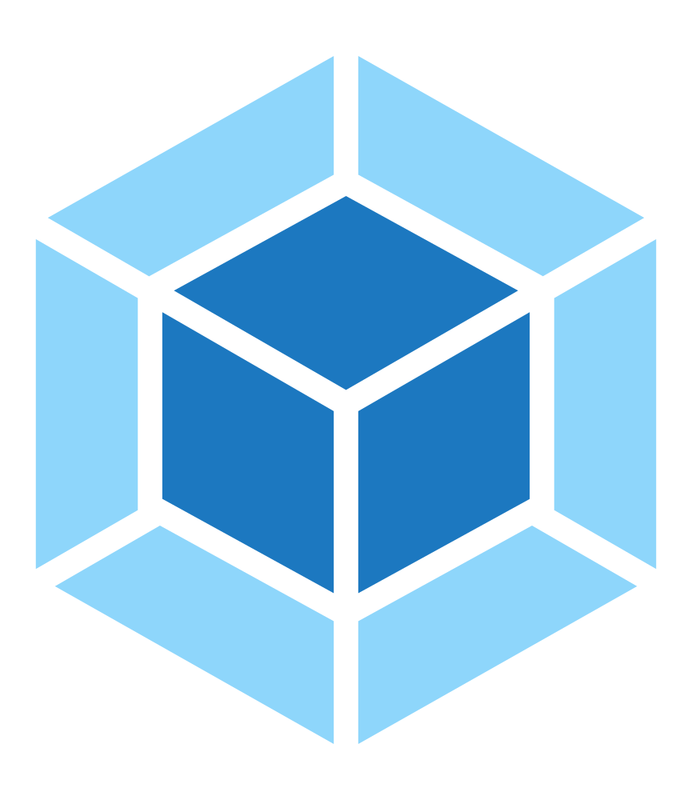</td>
        <td></td>
        <td>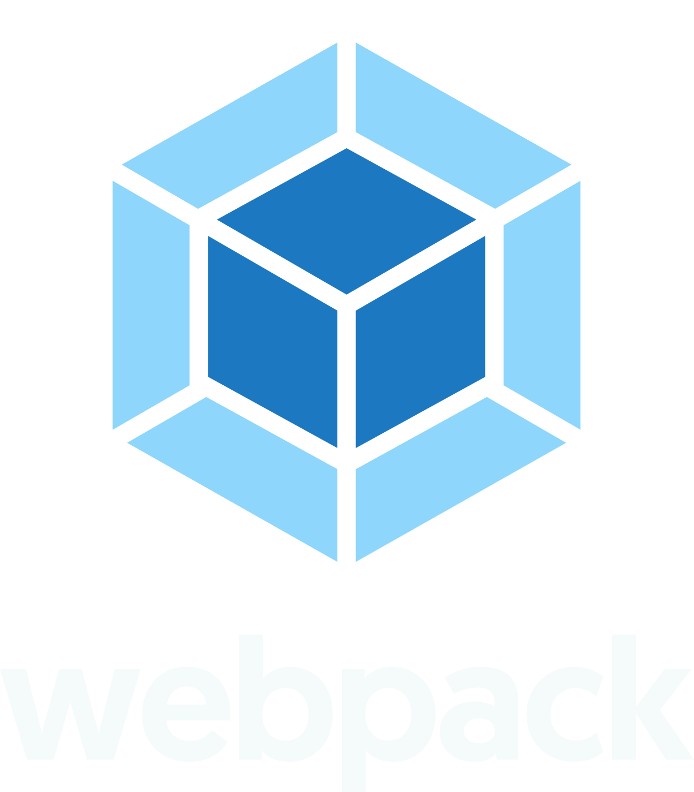</td>
        <td>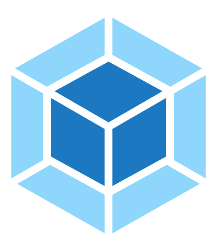</td>
    </tr>
    <tr>
        <th>color</th>
        <td></td>
        <td>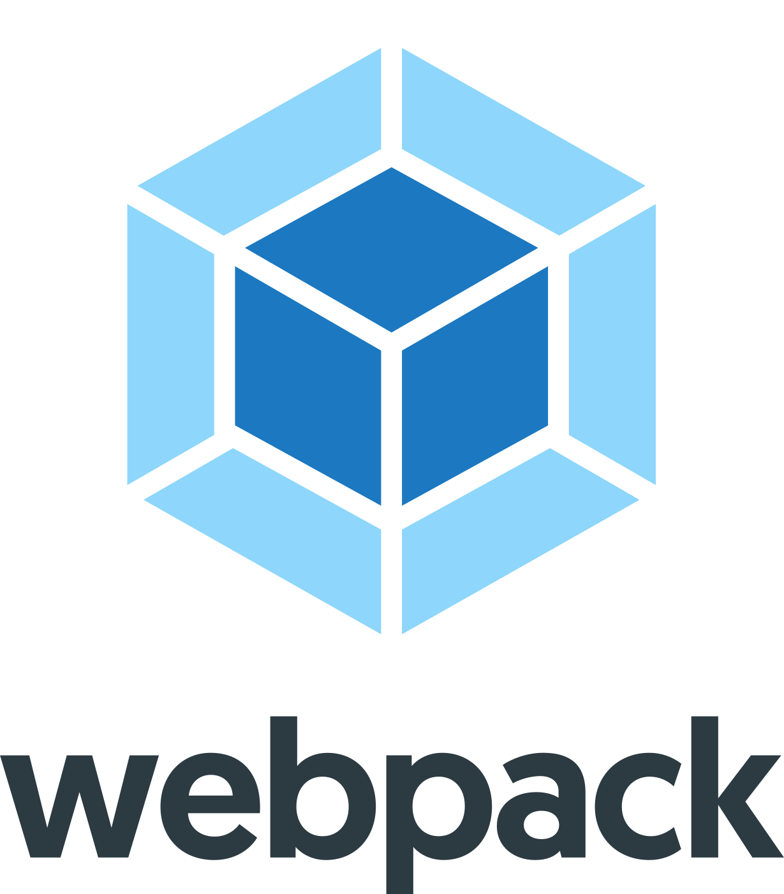</td>
        <td></td>
        <td></td>
        <td>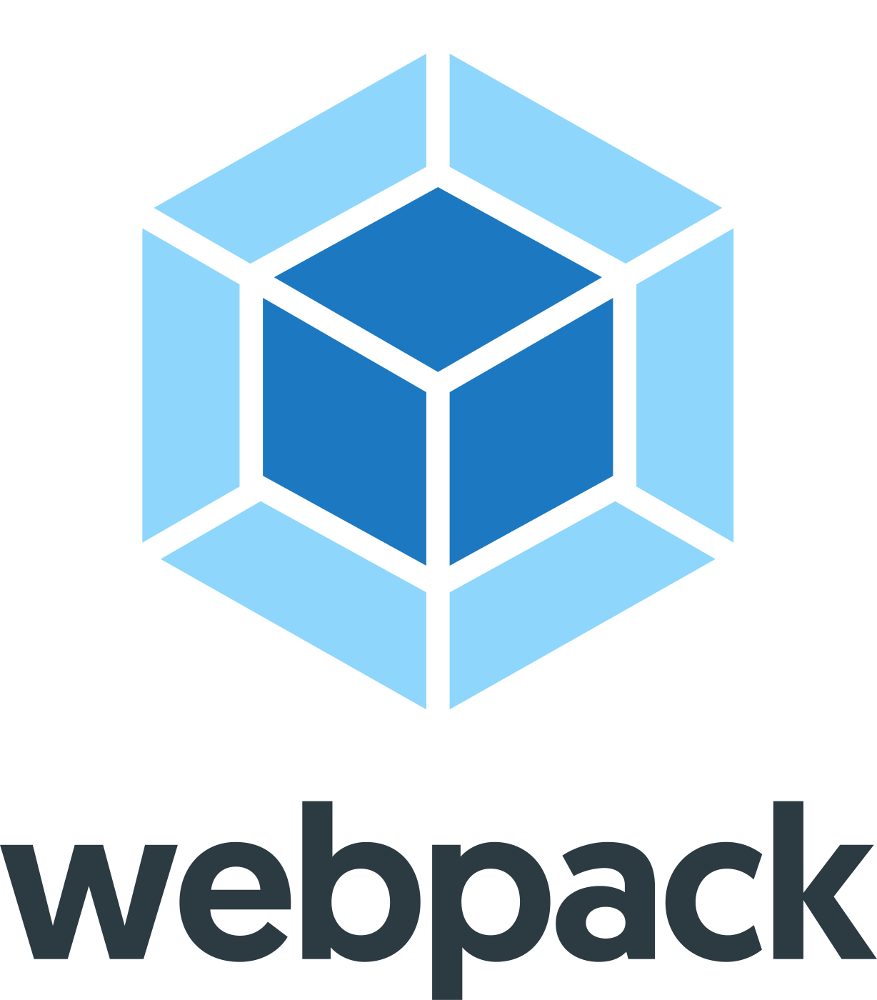</td>
        <td></td>
    </tr>
</table>

## Growth Projects

Growth projects have indicated they are interested in becoming Impact projects, and have identified a growth plan for doing so. Growth projects receive mentorship from the CPC and are expected to actively develop their community of contributors, governance, project documentation, and other variables identified in the growth plan that factor into broad success and adoption.

In order to support their active development, projects in the Growth stage have access to a higher level marketing and other resources, which are agreed upon and reviewed by the CPC on an annual basis.

### Architect

<table>
    <tr>
    	<th colspan="7"></th>
    </tr>
    <tr>
        <th width="120"></th>
        <th colspan="3">PNG</th>
        <th colspan="3">SVG</th>
    </tr>
    <tr>
        <th width="120"></th>
        <th>horizontal</th>
        <th>stacked</th>
        <th>icon</th>
        <th>horizontal</th>
        <th>stacked</th>
        <th>icon</th>
    </tr>
    <tr>
        <th>grayscale</th>
        <td></td>
        <td>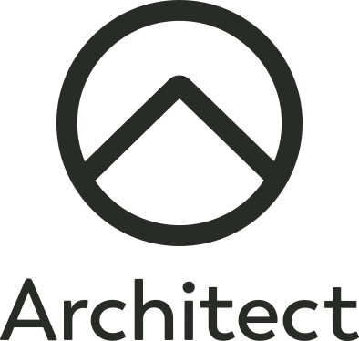</td>
        <td>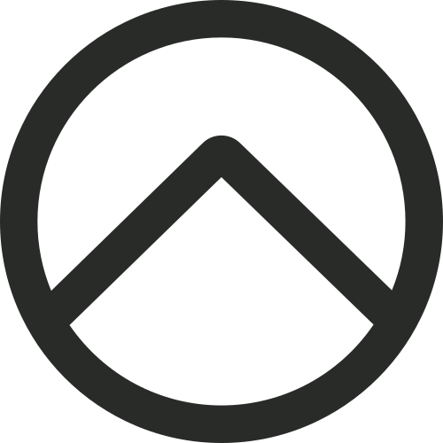</td>
        <td></td>
        <td>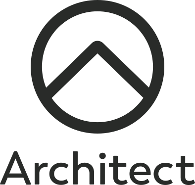</td>
        <td>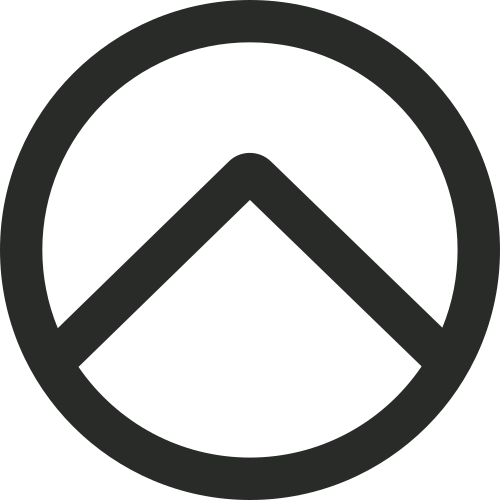</td>
    </tr>  
</table>

### Intern

<table>
    <tr>
    	<th colspan="7"></th>
    </tr>
    <tr>
        <th width="120"></th>
        <th colspan="3">PNG</th>
        <th colspan="3">SVG</th>
    </tr>
    <tr>
        <th width="120"></th>
        <th>horizontal</th>
        <th>stacked</th>
        <th>icon</th>
        <th>horizontal</th>
        <th>stacked</th>
        <th>icon</th>
    </tr>
    <tr>
        <th>color</th>
        <td></td>
        <td></td>
        <td></td>
        <td></td>
        <td></td>
        <td></td>
    </tr>  
</table>

### Mocha

<table>
    <tr>
    	<th colspan="7"></th>
    </tr>
    <tr>
        <th width="120"></th>
        <th colspan="3">PNG</th>
        <th colspan="3">SVG</th>
    </tr>
    <tr>
        <th width="120"></th>
        <th>horizontal</th>
        <th>stacked</th>
        <th>icon</th>
        <th>horizontal</th>
        <th>stacked</th>
        <th>icon</th>
    </tr>
    <tr>
        <th>color</th>
        <td>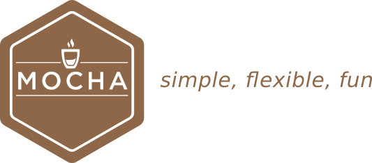</td>
        <td></td>
        <td></td>
        <td></td>
        <td>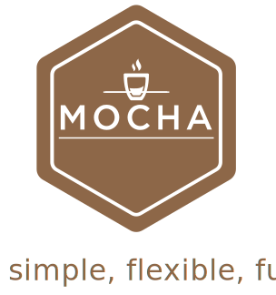</td>
        <td></td>
    </tr>  
</table>

### Node-RED

<table>
    <tr>
    	<th colspan="7"></th>
    </tr>
    <tr>
        <th width="120"></th>
        <th colspan="3">PNG</th>
        <th colspan="3">SVG</th>
    </tr>
    <tr>
        <th width="120"></th>
        <th>horizontal</th>
        <th>stacked</th>
        <th>icon</th>
        <th>horizontal</th>
        <th>stacked</th>
        <th>icon</th>
    </tr>
    <tr>
        <th>color</th>
        <td></td>
        <td></td>
        <td></td>
        <td></td>
        <td></td>
        <td></td>
    </tr>  
</table>

### WebdriverIO

<table>
    <tr>
    	<th colspan="7"></th>
    </tr>
    <tr>
        <th width="120"></th>
        <th colspan="3">PNG</th>
        <th colspan="3">SVG</th>
    </tr>
    <tr>
        <th width="120"></th>
        <th>horizontal</th>
        <th>stacked</th>
        <th>icon</th>
        <th>horizontal</th>
        <th>stacked</th>
        <th>icon</th>
    </tr>
    <tr>
        <th>color</th>
        <td></td>
        <td></td>
        <td></td>
        <td></td>
        <td></td>
        <td>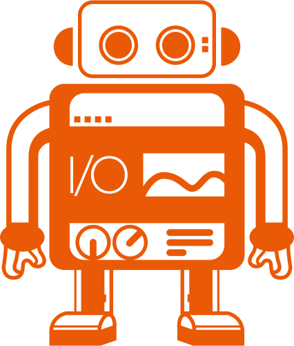</td>
    </tr>  
</table>

### webhint

- [webhint artwork repo](https://github.com/webhintio/artwork)

<table>
    <tr>
    	<th colspan="7"></th>
    </tr>
    <tr>
        <th width="120"></th>
        <th colspan="3">PNG</th>
        <th colspan="3">SVG</th>
    </tr>
    <tr>
        <th width="120"></th>
        <th>horizontal</th>
        <th>stacked</th>
        <th>icon</th>
        <th>horizontal</th>
        <th>stacked</th>
        <th>icon</th>
    </tr>
    <tr>
        <th>color</th>
        <td></td>
        <td></td>
        <td>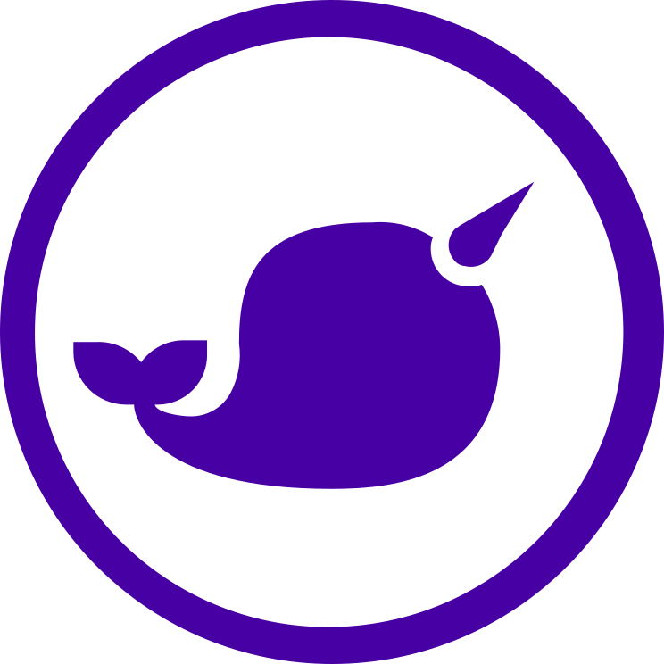</td>
        <td></td>
        <td></td>
        <td></td>
    </tr>  
</table>

## At-Large Projects

### eslint

<table>
    <tr>
    	<th colspan="7"></th>
    </tr>
    <tr>
        <th width="120"></th>
        <th colspan="3">PNG</th>
        <th colspan="3">SVG</th>
    </tr>
    <tr>
        <th width="120"></th>
        <th>horizontal</th>
        <th>stacked</th>
        <th>icon</th>
        <th>horizontal</th>
        <th>stacked</th>
        <th>icon</th>
    </tr>
    <tr>
        <th>color</th>
        <td></td>
        <td>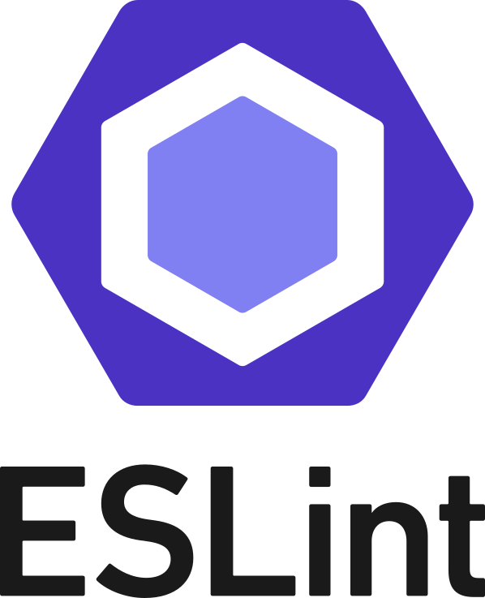</td>
        <td>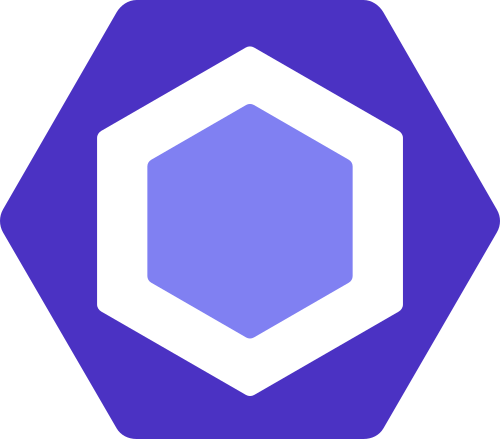</td>
        <td></td>
        <td>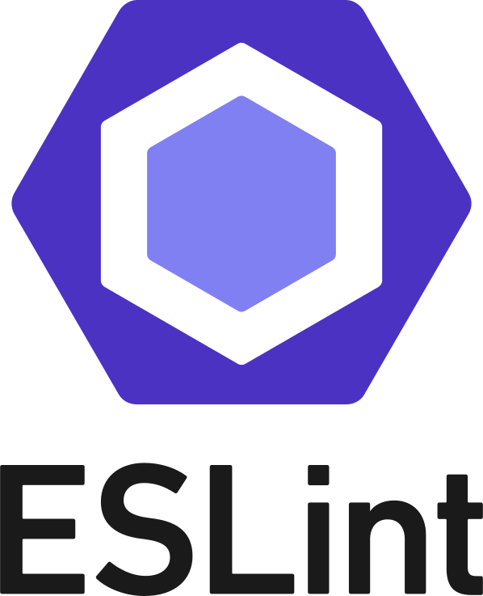</td>
        <td>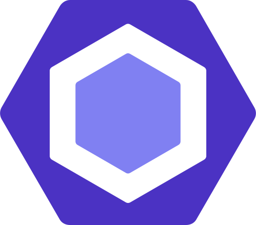</td>    </tr>
    </tr>
</table>

### Esprima

<table>
    <tr>
    	<th colspan="7"></th>
    </tr>
    <tr>
        <th width="120"></th>
        <th colspan="3">PNG</th>
        <th colspan="3">SVG</th>
    </tr>
    <tr>
        <th width="120"></th>
        <th>horizontal</th>
        <th>stacked</th>
        <th>icon</th>
        <th>horizontal</th>
        <th>stacked</th>
        <th>icon</th>
    </tr>
    <tr>
        <th>color</th>
        <td></td>
        <td></td>
        <td></td>
        <td></td>
        <td></td>
        <td></td>    </tr>
    </tr>
</table>

### Express

<table>
    <tr>
    	<th colspan="7"></th>
    </tr>
    <tr>
        <th width="120"></th>
        <th colspan="3">PNG</th>
        <th colspan="3">SVG</th>
    </tr>
    <tr>
        <th width="120"></th>
        <th>horizontal</th>
        <th>stacked</th>
        <th>icon</th>
        <th>horizontal</th>
        <th>stacked</th>
        <th>icon</th>
    </tr>
    <tr>
        <th>black</th>
        <td></td>
        <td></td>
        <td></td>
        <td></td>
        <td></td>
        <td></td>    </tr>
    </tr>
</table>

### Globalize

<table>
    <tr>
    	<th colspan="7"></th>
    </tr>
    <tr>
        <th width="120"></th>
        <th colspan="3">PNG</th>
        <th colspan="3">SVG</th>
    </tr>
    <tr>
        <th width="120"></th>
        <th>horizontal</th>
        <th>stacked</th>
        <th>icon</th>
        <th>horizontal</th>
        <th>stacked</th>
        <th>icon</th>
    </tr>
    <tr>
        <th>color, dark background</th>
        <td></td>
        <td></td>
        <td></td>
        <td></td>
        <td></td>
        <td></td>    </tr>
    </tr>
    <tr>
        <th>color</th>
        <td></td>
        <td></td>
        <td></td>
        <td></td>
        <td></td>
        <td></td>    </tr>
    </tr>
</table>

### Grunt

<table>
    <tr>
    	<th colspan="7"></th>
    </tr>
    <tr>
        <th width="120"></th>
        <th colspan="3">PNG</th>
        <th colspan="3">SVG</th>
    </tr>
    <tr>
        <th width="120"></th>
        <th>horizontal</th>
        <th>stacked</th>
        <th>icon</th>
        <th>horizontal</th>
        <th>stacked</th>
        <th>icon</th>
    </tr>
    <tr>
        <th>color</th>
        <td></td>
        <td></td>
        <td></td>
        <td></td>
        <td></td>
        <td></td>    </tr>
    </tr>
</table>

### HospitalRun

- [HospitalRun artwork repo](https://github.com/HospitalRun/design)

<table>
    <tr>
    	<th colspan="7"></th>
    </tr>
    <tr>
        <th width="120"></th>
        <th colspan="3">PNG</th>
        <th colspan="3">SVG</th>
    </tr>
    <tr>
        <th width="120"></th>
        <th>horizontal</th>
        <th>stacked</th>
        <th>icon</th>
        <th>horizontal</th>
        <th>stacked</th>
        <th>icon</th>
    </tr>
    <tr>
        <th>color, dark background</th>
        <td></td>
        <td></td>
        <td></td>
        <td></td>
        <td></td>
        <td></td>    </tr>
    </tr>
     <tr>
        <th>color</th>
        <td></td>
        <td></td>
        <td></td>
        <td></td>
        <td></td>
        <td></td>    </tr>
    </tr>
</table>

### Interledger.js

<table>
    <tr>
    	<th colspan="7"></th>
    </tr>
    <tr>
        <th width="120"></th>
        <th colspan="3">PNG</th>
        <th colspan="3">SVG</th>
    </tr>
    <tr>
        <th width="120"></th>
        <th>horizontal</th>
        <th>stacked</th>
        <th>icon</th>
        <th>horizontal</th>
        <th>stacked</th>
        <th>icon</th>
    </tr>
    <tr>
        <th>color</th>
        <td></td>
        <td></td>
        <td>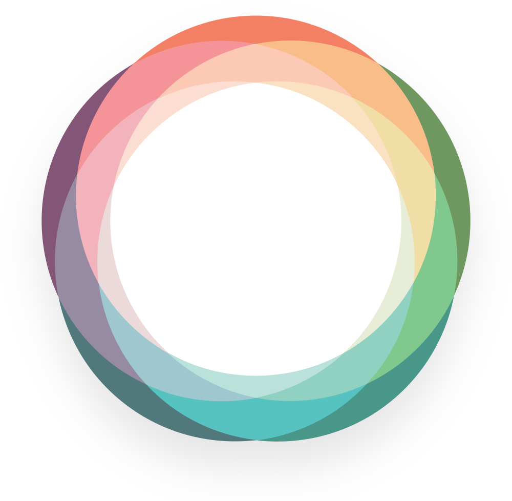</td>
        <td></td>
        <td></td>
        <td>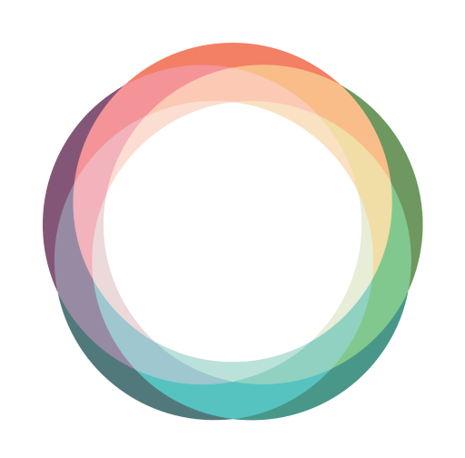</td>    </tr>
    </tr>
</table>

### JerryScript

<table>
    <tr>
    	<th colspan="7"></th>
    </tr>
    <tr>
        <th width="120"></th>
        <th colspan="3">PNG</th>
        <th colspan="3">SVG</th>
    </tr>
    <tr>
        <th width="120"></th>
        <th>horizontal</th>
        <th>stacked</th>
        <th>icon</th>
        <th>horizontal</th>
        <th>stacked</th>
        <th>icon</th>
    </tr>
    <tr>
        <th>color</th>
        <td></td>
        <td></td>
        <td></td>
        <td></td>
        <td></td>
        <td></td>    </tr>
    </tr>
</table>

### Libuv

<table>
    <tr>
    	<th colspan="7"></th>
    </tr>
    <tr>
        <th width="120"></th>
        <th colspan="3">PNG</th>
        <th colspan="3">SVG</th>
    </tr>
    <tr>
        <th width="120"></th>
        <th>horizontal</th>
        <th>stacked</th>
        <th>icon</th>
        <th>horizontal</th>
        <th>stacked</th>
        <th>icon</th>
    </tr>
    <tr>
        <th>color</th>
        <td></td>
        <td></td>
        <td></td>
        <td></td>
        <td></td>
        <td></td>    </tr>
    </tr>
    <tr>
        <th>grayscale</th>
        <td></td>
        <td></td>
        <td></td>
        <td></td>
        <td></td>
        <td></td>    </tr>
    </tr>
</table>

### Lodash

<table>
    <tr>
    	<th colspan="7"></th>
    </tr>
    <tr>
        <th width="120"></th>
        <th colspan="3">PNG</th>
        <th colspan="3">SVG</th>
    </tr>
    <tr>
        <th width="120"></th>
        <th>horizontal</th>
        <th>stacked</th>
        <th>icon</th>
        <th>horizontal</th>
        <th>stacked</th>
        <th>icon</th>
    </tr>
    <tr>
        <th>color</th>
        <td></td>
        <td></td>
        <td></td>
        <td></td>
        <td></td>
        <td>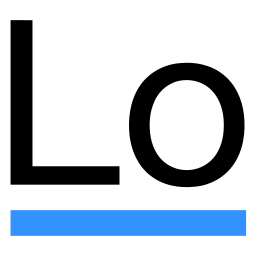</td>    </tr>
    </tr>
</table>

### Marko

<table>
    <tr>
    	<th colspan="7"></th>
    </tr>
    <tr>
        <th width="120"></th>
        <th colspan="3">PNG</th>
        <th colspan="3">SVG</th>
    </tr>
    <tr>
        <th width="120"></th>
        <th>horizontal</th>
        <th>stacked</th>
        <th>icon</th>
        <th>horizontal</th>
        <th>stacked</th>
        <th>icon</th>
    </tr>
    <tr>
        <th>color</th>
        <td></td>
        <td></td>
        <td>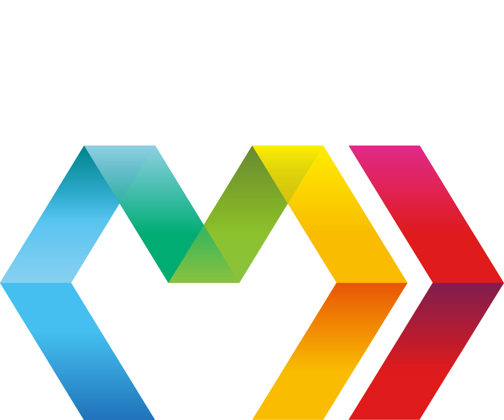</td>
        <td></td>
        <td>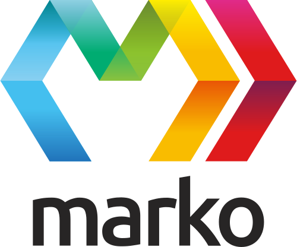</td>
        <td></td>    </tr>
    </tr>
</table>

### messageformat

<table>
    <tr>
    	<th colspan="7"></th>
    </tr>
    <tr>
        <th width="120"></th>
        <th colspan="3">PNG</th>
        <th colspan="3">SVG</th>
    </tr>
    <tr>
        <th width="120"></th>
        <th>horizontal</th>
        <th>stacked</th>
        <th>icon</th>
        <th>horizontal</th>
        <th>stacked</th>
        <th>icon</th>
    </tr>
    <tr>
        <th>color</th>
        <td></td>
        <td></td>
        <td></td>
        <td></td>
        <td></td>
        <td></td>    </tr>
    </tr>
</table>

### Moment

<table>
    <tr>
    	<th colspan="7"></th>
    </tr>
    <tr>
        <th width="120"></th>
        <th colspan="3">PNG</th>
        <th colspan="3">SVG</th>
    </tr>
    <tr>
        <th width="120"></th>
        <th>horizontal</th>
        <th>stacked</th>
        <th>icon</th>
        <th>horizontal</th>
        <th>stacked</th>
        <th>icon</th>
    </tr>
    <tr>
        <th>color</th>
        <td></td>
        <td></td>
        <td></td>
        <td></td>
        <td></td>
        <td></td>    </tr>
    </tr>
</table>

### PEP

<table>
    <tr>
    	<th colspan="7"></th>
    </tr>
    <tr>
        <th width="120"></th>
        <th colspan="3">PNG</th>
        <th colspan="3">SVG</th>
    </tr>
    <tr>
        <th width="120"></th>
        <th>horizontal</th>
        <th>stacked</th>
        <th>icon</th>
        <th>horizontal</th>
        <th>stacked</th>
        <th>icon</th>
    </tr>
    <tr>
        <th>color</th>
        <td></td>
        <td></td>
        <td></td>
        <td></td>
        <td></td>
        <td></td>    </tr>
    </tr>
</table>

### QUnit

- [QUnit color study](./projects/qunit/other/qunit-color_study.ai)

<table>
    <tr>
    	<th colspan="7"></th>
    </tr>
    <tr>
        <th width="120"></th>
        <th colspan="3">PNG</th>
        <th colspan="3">SVG</th>
    </tr>
    <tr>
        <th width="120"></th>
        <th>horizontal</th>
        <th>stacked</th>
        <th>icon</th>
        <th>horizontal</th>
        <th>stacked</th>
        <th>icon</th>
    </tr>
    <tr>
        <th>color, dark background</th>
        <td></td>
        <td></td>
        <td></td>
        <td></td>
        <td></td>
        <td></td>
    </tr>  
    <tr>
        <th>color</th>
        <td></td>
        <td></td>
        <td></td>
        <td></td>
        <td></td>
        <td></td>
    </tr>
</table>

## Emeritus Projects

Emeritus projects are those which the maintainers feel have reached or are nearing end-of-life. Emeritus projects have contributed to the ecosystem, but are not necessarily recommended for modern development as there may be more actively maintained choices.

The Foundation appreciates the contributions of these projects and their communities, and the role they have played in moving the ecosystem forward.

### Chassis

<table>
    <tr>
    	<th colspan="7"></th>
    </tr>
    <tr>
        <th width="120"></th>
        <th colspan="3">PNG</th>
        <th colspan="3">SVG</th>
    </tr>
    <tr>
        <th width="120"></th>
        <th>horizontal</th>
        <th>stacked</th>
        <th>icon</th>
        <th>horizontal</th>
        <th>stacked</th>
        <th>icon</th>
    </tr>
    <tr>
        <th>color</th>
        <td></td>
        <td></td>
        <td></td>
        <td></td>
        <td></td>
        <td></td>
    </tr>
    <tr>
        <th>grayscale</th>
        <td></td>
        <td></td>
        <td></td>
        <td></td>
        <td></td>
        <td></td>
    </tr>  
    <tr>
        <th>white</th>
        <td></td>
        <td>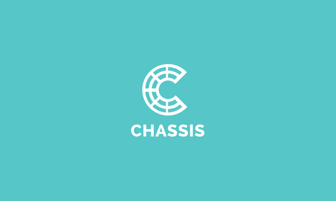</td>
        <td>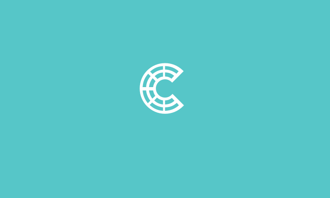</td>
        <td></td>
        <td>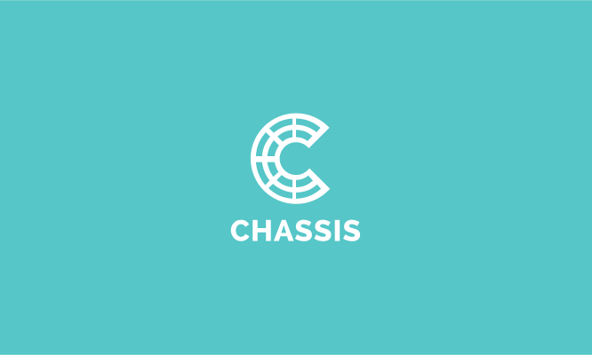</td>
        <td>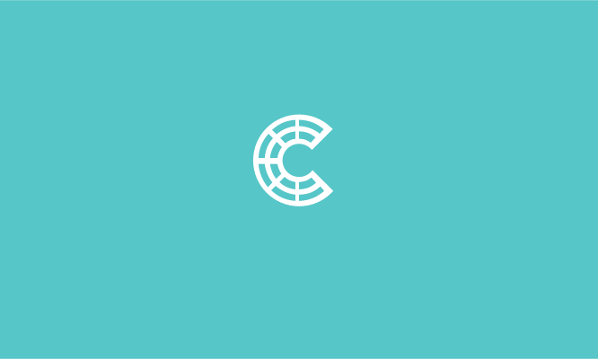</td>
    </tr>  
</table>

### Jed

<table>
    <tr>
    	<th colspan="7"></th>
    </tr>
    <tr>
        <th width="120"></th>
        <th colspan="3">PNG</th>
        <th colspan="3">SVG</th>
    </tr>
    <tr>
        <th width="120"></th>
        <th>horizontal</th>
        <th>stacked</th>
        <th>icon</th>
        <th>horizontal</th>
        <th>stacked</th>
        <th>icon</th>
    </tr>
    <tr>
        <th>grayscale</th>
        <td></td>
        <td></td>
        <td></td>
        <td></td>
        <td></td>
        <td></td>
    </tr>  
</table>

### jQuery Mobile

- [jQuery Mobile color study](./projects/jquery_mobile/other/jquery_mobile-color_study.ai)

<table>
    <tr>
    	<th colspan="7"></th>
    </tr>
    <tr>
        <th width="120"></th>
        <th colspan="3">PNG</th>
        <th colspan="3">SVG</th>
    </tr>
    <tr>
        <th width="120"></th>
        <th>horizontal</th>
        <th>stacked</th>
        <th>icon</th>
        <th>horizontal</th>
        <th>stacked</th>
        <th>icon</th>
    </tr>
    <tr>
        <th>color, dark background</th>
        <td></td>
        <td></td>
        <td></td>
        <td></td>
        <td></td>
        <td></td>
    </tr>
    <tr>
        <th>color</th>
        <td></td>
        <td></td>
        <td></td>
        <td></td>
        <td></td>
        <td></td>
    </tr>
</table>

### jQuery UI

- [jQuery UI color study](./projects/jquery_ui/other/jquery_ui-color_study.ai)

<table>
    <tr>
    	<th colspan="7"></th>
    </tr>
    <tr>
        <th width="120"></th>
        <th colspan="3">PNG</th>
        <th colspan="3">SVG</th>
    </tr>
    <tr>
        <th width="120"></th>
        <th>horizontal</th>
        <th>stacked</th>
        <th>icon</th>
        <th>horizontal</th>
        <th>stacked</th>
        <th>icon</th>
    </tr>
    <tr>
        <th>color, dark background</th>
        <td></td>
        <td></td>
        <td></td>
        <td></td>
        <td></td>
        <td></td>
    </tr>
    <tr>
        <th>color</th>
        <td></td>
        <td></td>
        <td></td>
        <td></td>
        <td></td>
        <td></td>
    </tr>
</table>

### RequireJS

<table>
    <tr>
    	<th colspan="7"></th>
    </tr>
    <tr>
        <th width="120"></th>
        <th colspan="3">PNG</th>
        <th colspan="3">SVG</th>
    </tr>
    <tr>
        <th width="120"></th>
        <th>horizontal</th>
        <th>stacked</th>
        <th>icon</th>
        <th>horizontal</th>
        <th>stacked</th>
        <th>icon</th>
    </tr>
    <tr>
        <th>color</th>
        <td></td>
        <td>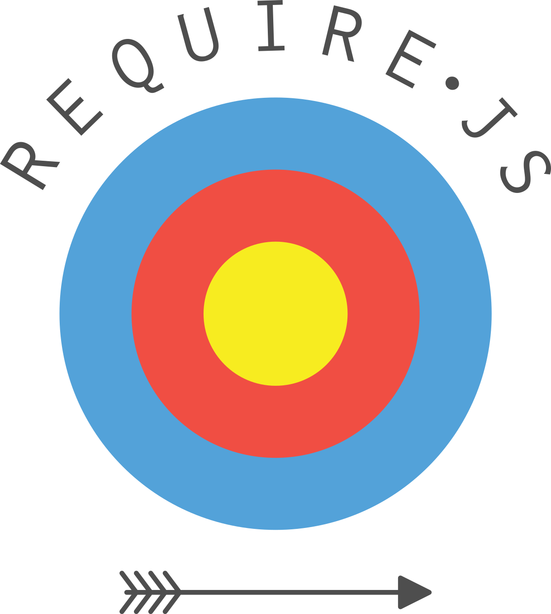</td>
        <td></td>
        <td></td>
        <td></td>
        <td></td>
    </tr>  
</table>

### Sizzle

<table>
    <tr>
    	<th colspan="7"></th>
    </tr>
    <tr>
        <th width="120"></th>
        <th colspan="3">PNG</th>
        <th colspan="3">SVG</th>
    </tr>
    <tr>
        <th width="120"></th>
        <th>horizontal</th>
        <th>stacked</th>
        <th>icon</th>
        <th>horizontal</th>
        <th>stacked</th>
        <th>icon</th>
    </tr>
    <tr>
        <th>color, dark background</th>
        <td></td>
        <td></td>
        <td></td>
        <td></td>
        <td></td>
        <td></td>
    </tr>  
    <tr>
        <th>color</th>
        <td></td>
        <td></td>
        <td></td>
        <td></td>
        <td></td>
        <td></td>
    </tr>  
</table>

## Copyright notices for project website footers

If you're building or managing a website for an OpenJS Foundation-hosted project, please use one of these standard footers which have been approved by OpenJS Foundation legal counsel and the Board of Directors:

#### For nodejs.org, and projects which reference Node.js

##### Text

> Copyright [OpenJS Foundation](https://openjsf.org) and [project name] contributors. All rights reserved. The [OpenJS Foundation](https://openjsf.org) has registered trademarks and uses trademarks.  For a list of trademarks of the [OpenJS Foundation](https://openjsf.org), please see our [Trademark Policy](https://trademark-policy.openjsf.org/) and [Trademark List](https://trademark-list.openjsf.org/).  Node.js is a trademark of Joyent, Inc. and is used with its permission.  Trademarks and logos not indicated on the [list of OpenJS Foundation trademarks](https://trademark-list.openjsf.org) are trademarks™ or registered® trademarks of their respective holders. Use of them does not imply any affiliation with or endorsement by them.
> 
> [The OpenJS Foundation](https://openjsf.org/) | [Terms of Use](https://terms-of-use.openjsf.org/) | [Privacy Policy](https://privacy-policy.openjsf.org/) | [OpenJS Foundation Bylaws](https://bylaws.openjsf.org/) | [Trademark Policy](https://trademark-policy.openjsf.org/) | [Trademark List](https://trademark-list.openjsf.org/) | [Cookie Policy](https://www.linuxfoundation.org/cookies/)
##### Markdown

```
Copyright [OpenJS Foundation](https://openjsf.org) and [project name] contributors. All rights reserved. The [OpenJS Foundation](https://openjsf.org) has registered trademarks and uses trademarks.  For a list of trademarks of the [OpenJS Foundation](https://openjsf.org), please see our [Trademark Policy](https://trademark-policy.openjsf.org/) and [Trademark List](https://trademark-list.openjsf.org/).  Node.js is a trademark of Joyent, Inc. and is used with its permission.  Trademarks and logos not indicated on the [list of OpenJS Foundation trademarks](https://trademark-list.openjsf.org) are trademarks™ or registered® trademarks of their respective holders. Use of them does not imply any affiliation with or endorsement by them.
[The OpenJS Foundation](https://openjsf.org/) | [Terms of Use](https://terms-of-use.openjsf.org/) | [Privacy Policy](https://privacy-policy.openjsf.org/) | [OpenJS Foundation Bylaws](https://bylaws.openjsf.org/) | [Trademark Policy](https://trademark-policy.openjsf.org/) | [Trademark List](https://trademark-list.openjsf.org/) | [Cookie Policy](https://www.linuxfoundation.org/cookies/)
```

##### HTML

```
<p>Copyright <a href="https://openjsf.org">OpenJS Foundation</a> and [project name] contributors. All rights reserved. The <a href="https://openjsf.org">OpenJS Foundation</a> has registered trademarks and uses trademarks.  For a list of trademarks of the <a href="https://openjsf.org">OpenJS Foundation</a>, please see our <a href="https://trademark-policy.openjsf.org">Trademark Policy</a> and <a href="https://trademark-list.openjsf.org">Trademark List</a>.  Node.js is a trademark of Joyent, Inc. and is used with its permission. Trademarks and logos not indicated on the <a href="https://trademark-list.openjsf.org">list of OpenJS Foundation trademarks</a> are trademarks&trade; or registered&reg; trademarks of their respective holders. Use of them does not imply any affiliation with or endorsement by them.</p>
<p><a href="https://openjsf.org">The OpenJS Foundation</a> | <a href="https://terms-of-use.openjsf.org">Terms of Use</a> | <a href="https://privacy-policy.openjsf.org">Privacy Policy</a> | <a href="https://bylaws.openjsf.org">OpenJS Foundation Bylaws</a> | <a href="https://trademark-policy.openjsf.org">Trademark Policy</a> | <a href="https://trademark-list.openjsf.org">Trademark List</a> | <a href="https://www.linuxfoundation.org/cookies">Cookie Policy</a></p>
```

#### For projects unrelated to Node.js:

##### Text

> Copyright [OpenJS Foundation](https://openjsf.org) and [project name] contributors. All rights reserved. The [OpenJS Foundation](https://openjsf.org) has registered trademarks and uses trademarks.  For a list of trademarks of the [OpenJS Foundation](https://openjsf.org), please see our [Trademark Policy](https://trademark-policy.openjsf.org/) and [Trademark List](https://trademark-list.openjsf.org/).  Trademarks and logos not indicated on the [list of OpenJS Foundation trademarks](https://trademark-list.openjsf.org) are trademarks™ or registered® trademarks of their respective holders. Use of them does not imply any affiliation with or endorsement by them.
> 
> [The OpenJS Foundation](https://openjsf.org/) | [Terms of Use](https://terms-of-use.openjsf.org/) | [Privacy Policy](https://privacy-policy.openjsf.org/) | [OpenJS Foundation Bylaws](https://bylaws.openjsf.org/) | [Trademark Policy](https://trademark-policy.openjsf.org/) | [Trademark List](https://trademark-list.openjsf.org/) | [Cookie Policy](https://www.linuxfoundation.org/cookies/)
##### Markdown

```
Copyright [OpenJS Foundation](https://openjsf.org) and [project name] contributors. All rights reserved. The [OpenJS Foundation](https://openjsf.org) has registered trademarks and uses trademarks.  For a list of trademarks of the [OpenJS Foundation](https://openjsf.org), please see our [Trademark Policy](https://trademark-policy.openjsf.org/) and [Trademark List](https://trademark-list.openjsf.org/).  Trademarks and logos not indicated on the [list of OpenJS Foundation trademarks](https://trademark-list.openjsf.org) are trademarks™ or registered® trademarks of their respective holders. Use of them does not imply any affiliation with or endorsement by them.
[The OpenJS Foundation](https://openjsf.org/) | [Terms of Use](https://terms-of-use.openjsf.org/) | [Privacy Policy](https://privacy-policy.openjsf.org/) | [OpenJS Foundation Bylaws](https://bylaws.openjsf.org/) | [Trademark Policy](https://trademark-policy.openjsf.org/) | [Trademark List](https://trademark-list.openjsf.org/) | [Cookie Policy](https://www.linuxfoundation.org/cookies/)
```

##### HTML

```
<p>Copyright <a href="https://openjsf.org">OpenJS Foundation</a> and [project name] contributors. All rights reserved. The <a href="https://openjsf.org">OpenJS Foundation</a> has registered trademarks and uses trademarks.  For a list of trademarks of the <a href="https://openjsf.org">OpenJS Foundation</a>, please see our <a href="https://trademark-policy.openjsf.org">Trademark Policy</a> and <a href="https://trademark-list.openjsf.org">Trademark List</a>.  Trademarks and logos not indicated on the <a href="https://trademark-list.openjsf.org">list of OpenJS Foundation trademarks</a> are trademarks&trade; or registered&reg; trademarks of their respective holders. Use of them does not imply any affiliation with or endorsement by them.</p>
<p><a href="https://openjsf.org">The OpenJS Foundation</a> | <a href="https://terms-of-use.openjsf.org">Terms of Use</a> | <a href="https://privacy-policy.openjsf.org">Privacy Policy</a> | <a href="https://bylaws.openjsf.org">OpenJS Foundation Bylaws</a> | <a href="https://trademark-policy.openjsf.org">Trademark Policy</a> | <a href="https://trademark-list.openjsf.org">Trademark List</a> | <a href="https://www.linuxfoundation.org/cookies">Cookie Policy</a></p>
```

## Preparing artwork for contribution

If you plan to contribute artwork, please help us keep things consistent and organized by following these basic guidelines:

- Plain `.svg` is the preferred file format. Please start with this. We can help you convert `.ai`, `.eps`, or (in some cases) `.pdf` files.
- `.png` is preferred for non-vector images. We can help you convert your `.svg` to `.png` if need be. Please scale it to 500px in one dimension, at minimum.
- To the greatest extent possible, please try to trim whitespace around the image.

Please follow this naming convention: `project_name/project_name-type-orientation-color-background.filetype`

- `project_name`: lower case, convert spaces to underscores
- `type`: `icon` or `logo`, where the logo generally includes the icon and some text.
- `orientation`: for logos, `horizontal` or `stacked`
- `color`: the color of the image itself, e.g., `color`, `black`, `white`, `grayscale`
- `background`: optional, use `dark_background` for images with a color icon and white text

Pull requests welcomed!

---

Use of any trademark or logo is subject to the trademark policy available at [https://trademark-policy.openjsf.org](https://trademark-policy.openjsf.org). A list of the trademarks covered by this policy can be found at [https://trademark-list.openjsf.org](https://trademark-list.openjsf.org).

Questions? Please email [trademark@openjsf.org](mailto:trademark@openjsf.org).
