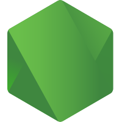

# Node.js Artwork

- [Pantone color versions](./other/nodejs-pantone.zip)
- [Node.js Design System](https://www.figma.com/design/a10cjjw3MzvRQMPT9FP3xz/Node.js?node-id=337-7756)
- [Node.js Branding](https://nodejs.org/en/about/branding)

<table>
    <tr>
    	<th colspan="7"></th>
    </tr>
    <tr>
        <th width="120"></th>
        <th colspan="3">PNG</th>
        <th colspan="3">SVG</th>
    </tr>
    <tr>
        <th width="120"></th>
        <th>horizontal</th>
        <th>stacked</th>
        <th>icon</th>
        <th>horizontal</th>
        <th>stacked</th>
        <th>icon</th>
    </tr>
    <tr>
        <th>"JS" icon, green</th>
        <td></td>
        <td></td>
        <td></td>
        <td></td>
        <td></td>
        <td></td>
    </tr>
    <tr>
        <th>"JS" icon, white</th>
        <td></td>
        <td></td>
        <td></td>
        <td></td>
        <td></td>
        <td></td>
    </tr>
    <tr>
        <th>color, dark background</th>
        <td></td>
        <td></td>
        <td></td>
        <td></td>
        <td></td>
        <td></td>
    </tr>  
    <tr>
        <th>color</th>
        <td></td>
        <td></td>
        <td></td>
        <td></td>
        <td></td>
        <td></td>
    </tr>
    <tr>
        <th>grayscale, dark background</th>
        <td></td>
        <td></td>
        <td></td>
        <td></td>
        <td></td>
        <td></td>
    </tr>
    <tr>
        <th>grayscale</th>
        <td></td>
        <td></td>
        <td></td>
        <td></td>
        <td></td>
        <td></td>
    </tr>
</table>

---

Use of any trademark or logo is subject to the trademark policy available at [https://trademark-policy.openjsf.org](https://trademark-policy.openjsf.org). A list of the trademarks covered by this policy can be found at [https://trademark-list.openjsf.org](https://trademark-list.openjsf.org).

Questions? Please email [trademark@openjsf.org](mailto:trademark@openjsf.org).
