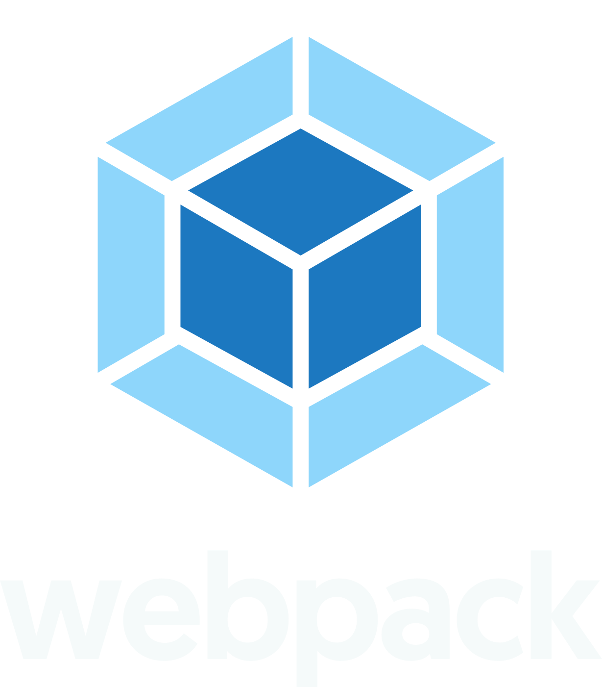
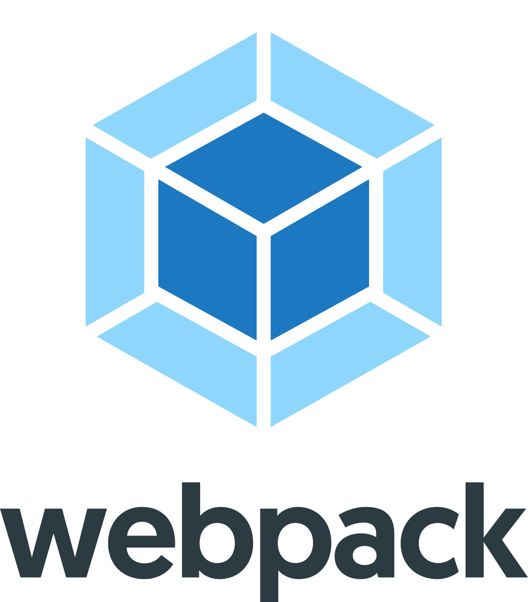
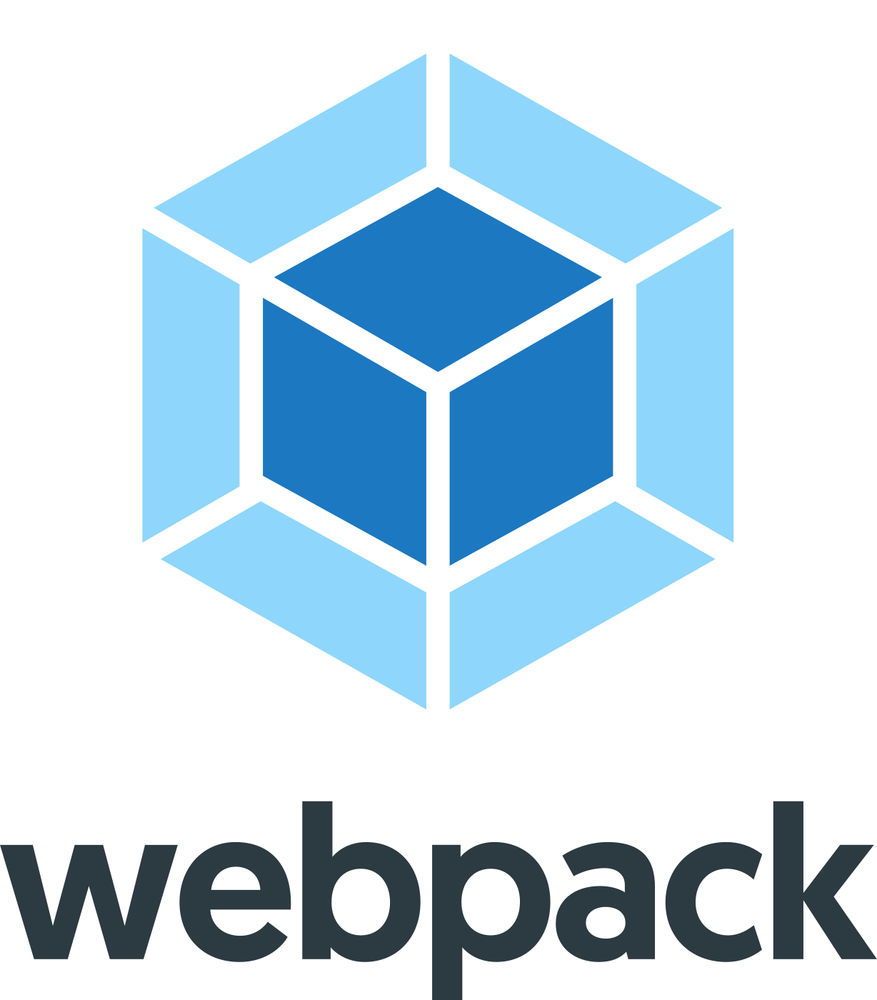

# Webpack Artwork

## Images

<table>
    <tr>
        <th width="120"></th>
        <th colspan="3">PNG</th>
        <th colspan="3">SVG</th>
    </tr>
    <tr>
        <th width="120"></th>
        <th>horizontal</th>
        <th>stacked</th>
        <th>icon</th>
        <th>horizontal</th>
        <th>stacked</th>
        <th>icon</th>
    </tr>
    <tr>
        <th>color, dark background</th>
        <td></td>
        <td></td>
        <td></td>
        <td></td>
        <td></td>
        <td></td>
    </tr>
    <tr>
        <th>color</th>
        <td></td>
        <td></td>
        <td></td>
        <td></td>
        <td></td>
        <td></td>
    </tr>
</table>

## Color Palette

<table>
    <tr>
        <th>Sample</th>
        <th>Color Name</th>
        <th>HEX Code</th>
        <th>RGB Code</th>
    </tr>
    <tr>
        <td></td>
        <td>Malibu</td>
        <td><code>#8dd6f9</code></td>
        <td><code>rgb(141, 214, 249)</code></td>
    </tr>
    <tr>
        <td></td>
        <td>Denim</td>
        <td><code>#1d78c1</code></td>
        <td><code>rgb(29, 120, 193)</code></td>
    </tr>
    <tr>
        <td></td>
        <td>Fiord</td>
        <td><code>#465E69</code></td>
        <td><code>rgb(70, 94, 105)</code></td>
    </tr>
    <tr>
        <td></td>
        <td>Outer Space</td>
        <td><code>#2B3A42</code></td>
        <td><code>rgb(43, 58, 66)</code></td>
    </tr>
    <tr>
        <td></td>
        <td>White</td>
        <td><code>#ffffff</code></td>
        <td><code>rgb(255, 255, 255)</code></td>
    </tr>
    <tr>
        <td></td>
        <td>Concrete</td>
        <td><code>#f2f2f2</code></td>
        <td><code>rgb(242, 242, 242)</code></td>
    </tr>
    <tr>
        <td></td>
        <td>Alto</td>
        <td><code>#dedede</code></td>
        <td><code>rgb(222, 222, 222)</code></td>
    </tr>
    <tr>
        <td></td>
        <td>Dusty Gray</td>
        <td><code>#999999</code></td>
        <td><code>rgb(153, 153, 153)</code></td>
    </tr>
    <tr>
        <td></td>
        <td>Dove Gray</td>
        <td><code>#666666</code></td>
        <td><code>rgb(102, 102, 102)</code></td>
    </tr>
    <tr>
        <td></td>
        <td>Emperor</td>
        <td><code>#535353</code></td>
        <td><code>rgb(83, 83, 83)</code></td>
    </tr>
    <tr>
        <td></td>
        <td>Mine Shaft</td>
        <td><code>#333333</code></td>
        <td><code>rgb(51, 51, 51)</code></td>
    </tr>
</table>

## Trademarks and Licensing

Webpack is a project of the OpenJS Foundation. Use of any trademark or logo is subject to the [trademark policy](https://trademark-policy.openjsf.org/). A list of the trademarks covered by this policy can be found at [https://trademark-list.openjsf.org](https://trademark-list.openjsf.org).

Questions? Please email [trademark@openjsf.org](mailto:trademark@openjsf.org).
